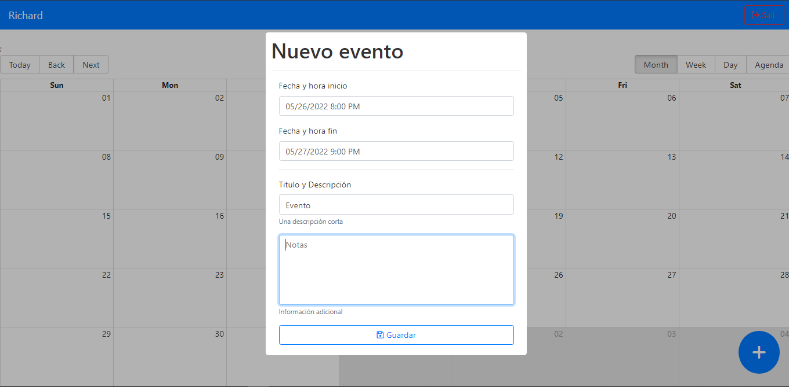

# Calendario con Redux toolkit

***node 16.17.3***

- Para correr en local usa

``` bash
  yarn dev ó npm run dev
```



## Notas

Calendar de react-big-calendar:

- importación de estilos
- utils con lo necesario para sus props
- componentes: tiene eventos o compnentes que puede recibir y ser personalizados

## Recursos

[React Bootstrap](https://getbootstrap.com/docs/4.5/getting-started/introduction/)
[font Awesome](https://cdnjs.cloudflare.com/ajax/libs/font-awesome/6.1.1/css/all.min.css)
[React big calendar](https://www.npmjs.com/package/react-big-calendar)
[datetime documentation](https://www.npmjs.com/package/react-datetime#customize-the-datepicker-appearance)
[Calendar demo and document](https://jquense.github.io/react-big-calendar/examples/index.html?path=/story/about-big-calendar--page)
[Sweetalert2](https://sweetalert2.github.io/#examples)

## Dependencies

``` bash
  npm i prettier
  npm i eslint-plugin-react
  npm i eslint-plugin-react-hooks
  npm i eslint-plugin-react-refresh
  npm i react-router-dom
  npm i react-big-calendar
  npm i date-fns
  npm i react-modal
  npm i react-datepicker
  npm i sweetalert2
  npm i react-redux @reduxjs/toolkit
  npm i react-redux
  npm i react-datetime (sin uso)
```
